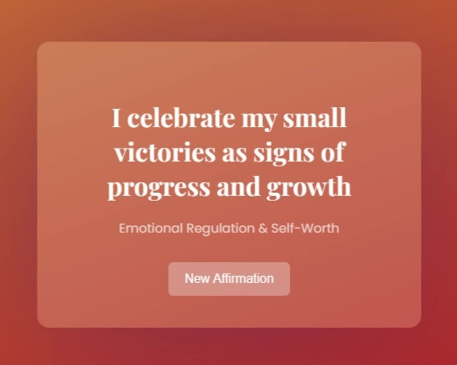

# 
👋🏼 Hi, I'm Ana Maria Dragieva

### 
I'm a Full Stack Developer building data-driven apps and creative interfaces that feel as good as they function...

 

### 
Code. Commit. Repeat. I'm just trying to keep the snake happy & well-fed ⬇️

<picture>
  <source media="(prefers-color-scheme: dark)" srcset="https://raw.githubusercontent.com/anamariadragieva/anamariadragieva/output/snake-dark.svg" />
  <source media="(prefers-color-scheme: light)" srcset="https://raw.githubusercontent.com/anamariadragieva/anamariadragieva/output/snake.svg" />
  
</picture>

---
## 
🛠️ My Tech Stack:

  
  
  
  
  
  
  
  
  
  
  

  
  
  
  
  
    

  
  
  
  
  
  
  
  
  
  
  
    

  
  
  
  
  
  
  
  
  
  
  
  
    

  
  
  
   
  
  
  
  
  
    
  
    

  
  
  
  
  
  
  
  

---
## 
🚀 Featured Projects

<table>
  <tr>
    <td>
      
    </td>
    <td>
      <strong>Mind in Motion</strong>
        
      Daily affirmations web app designed to inspire and empower individuals with ADHD. The app displays a random affirmation from a curated set of messages organised by theme.
      
      
      
        
      🔗 <a href="https://github.com/anamariadragieva/mind-in-motion-web-app" style="text-decoration: none;">Live Demo </a> |  
      📁 <a href="https://github.com/anamariadragieva/mind-in-motion-web-app" style="text-decoration: none;">Source Code</a>
       
    </td>
  </tr>
</table>

 
loading next projects..
 
 
..2.. Task Manager
 
 
..3.. Simon Says
 
 
..4.. Mondrian Compositions
 
 
..5.. Finance Calculator
 
 
..6.. Invoice Generator
  

---
## 
📫 Get in Touch 

Looking for a Full-Stack Developer who delivers clean, efficient, and scalable code?
 
I’d be glad to explore how I can support your next project or team.

### 
📧 Reach me directly at anamariatxt@gmail.com

#### You can find me on LinkedIn too 👉🏼 [View Profile](https://www.linkedin.com/in/anamariadragieva/)

#### Want to see more? I also have a [Portfolio Website](https://anamariadragieva.github.io/ana-maria-dragieva/)

